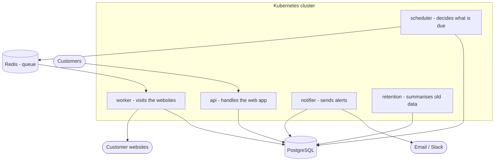
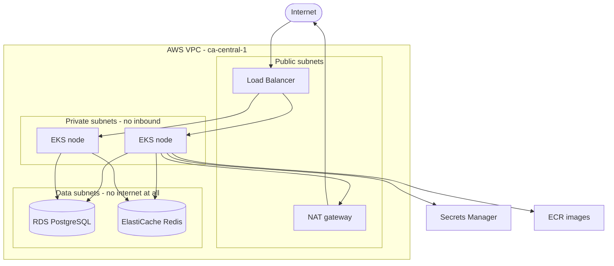

# Diagrams

## How the services fit together

## How it runs on AWS

The key point: the data subnets have no route to the internet in either
direction. Even if an attacker reached the database, there is no network path
out of it.
