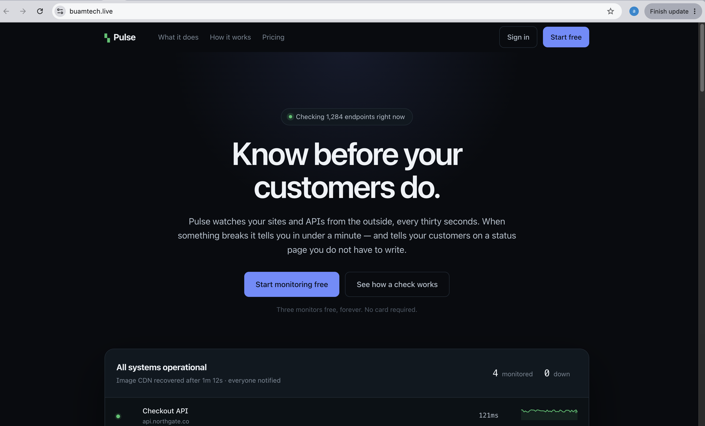
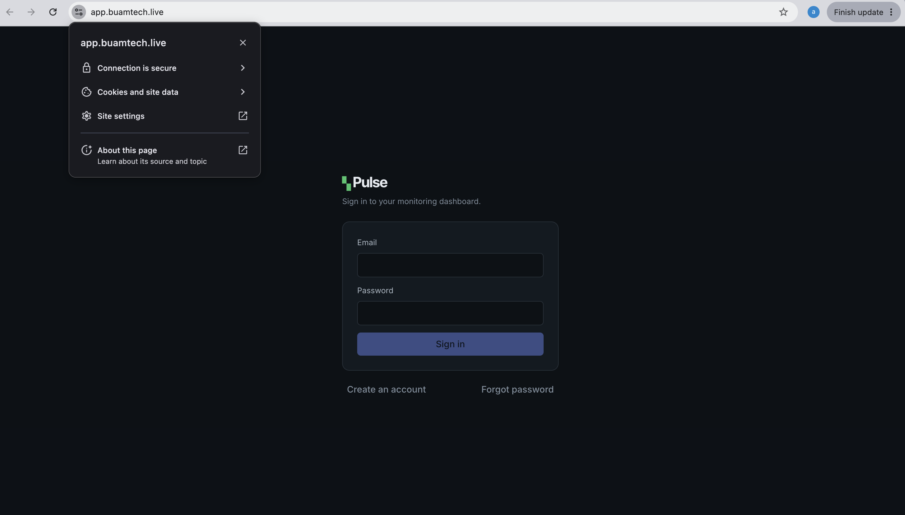
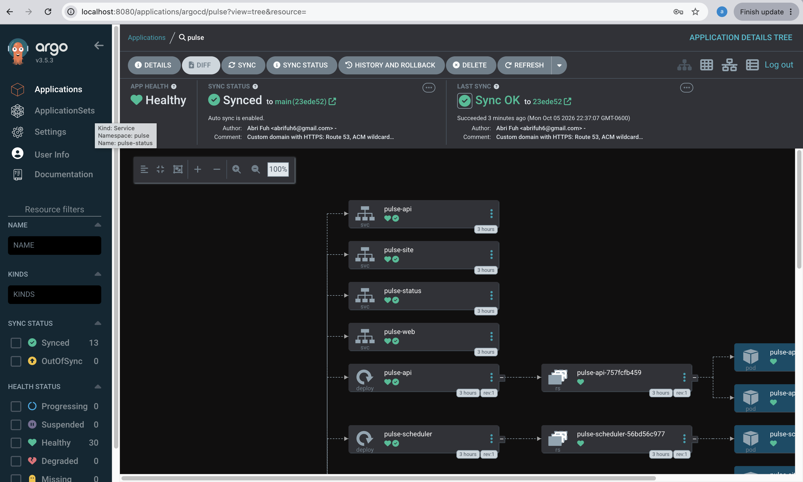
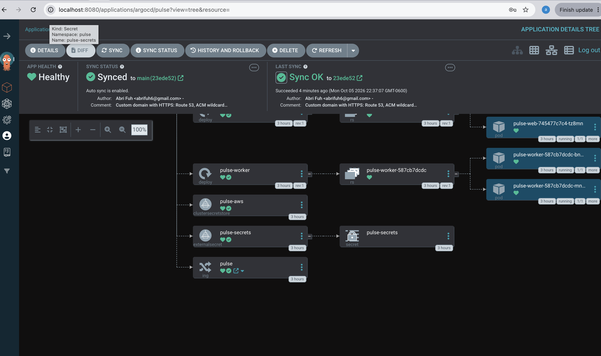
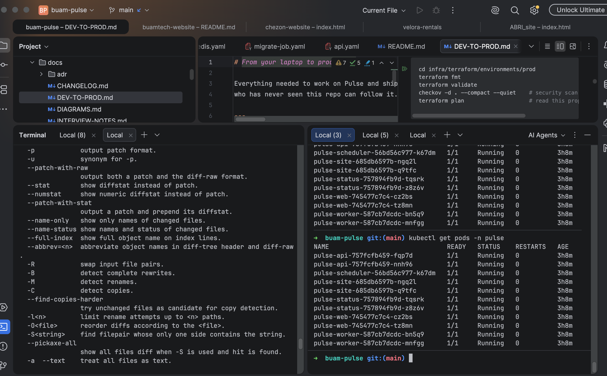

# Pulse — a monitoring SaaS, built and run end to end

Live at **[buamtech.live](https://buamtech.live)**. Source throughout this repo.

Pulse is an uptime monitoring service: it watches websites and APIs from
outside their network, alerts the owner when something breaks, and publishes a
status page for their customers. It was built to practise the whole lifecycle —
writing the product, containerising it, and running it on AWS — rather than any
single piece of it.

---

## It's a real product, not a demo

The landing page is served over HTTPS at a real domain. The hero is a live
simulated dashboard — a service fails, alerts, and recovers on a loop — so a
visitor sees the product working in about twenty seconds without clicking
anything.

Behind it is a complete SaaS: Stripe billing with monthly, quarterly and annual
plans and 14-day trials; teams with server-enforced roles; GDPR and PIPEDA data
export and account deletion. The kind of thing a company actually operates.

Three separate frontends on their own hostnames — `buamtech.live` for
marketing, `app.buamtech.live` for the dashboard, `status.buamtech.live` for
status pages — each a static app deployable independently.

---

## It runs on Kubernetes, reconciled from git

The cluster does not get deployed to by hand. ArgoCD watches this repo and
continuously makes the cluster match it — thirty resources, all healthy, synced
to a git commit. Change something by hand and ArgoCD puts it back; that is the
difference between a cluster someone configured once and one that maintains
itself.

The database password never appears in a config file. External Secrets reads it
from AWS Secrets Manager using an IAM role scoped to one service account, and
synthesises a Kubernetes secret the pods consume. This graph shows that path:
`ClusterSecretStore` → `ExternalSecret` → `Secret`.

Five Go services and three frontends, each with multiple replicas, all running.

---

## What's underneath

**Application** — five Go services sharing one PostgreSQL database and a Redis
queue, split by workload rather than by domain (a modular monolith, not
microservices — the distinction is argued in
[ADR 0007](adr/0007-service-boundaries.md)). Three React frontends.

**Infrastructure** — Terraform builds everything: a three-tier VPC where the
database subnets have no internet route in either direction, EKS, RDS,
ElastiCache, ECR, KMS, IRSA. 85 resources, reproducible from an empty account
in about eighteen minutes. Checkov scans it in CI — 105 checks pass, 24 are
skipped each with a written reason.

**Pipeline** — every push runs tests with the race detector, linting, Helm
lint, frontend type-checks, Terraform validation, and a container scan, then
publishes nine images to two registries tagged by commit.

Full detail: [architecture](ARCHITECTURE.md) · [dev-to-prod guide](DEV-TO-PROD.md)
· [decisions](adr/) · [what it doesn't do yet](ARCHITECTURE.md#what-pulse-doesnt-do-yet)

---

## The parts that taught me the most

Written up in full in [the interview notes](INTERVIEW-NOTES.md). Briefly:

- A security group that named the node group looked correct but blocked every
  pod, because pods get their own network interfaces carrying a *different*
  security group. It failed as a timeout, not a refusal — which pointed away
  from the cause.
- A migration job that deleted itself on success destroyed the evidence needed
  when the app then failed for an unrelated reason.
- Terraform and the cluster each own half the infrastructure. The load balancer
  is created by a controller inside the cluster, so teardown order is
  load-bearing — the first `terraform destroy` failed three times on leftovers.

None of those come from reading documentation. They come from running the thing.

---

*Built by [Abri Fuh](https://github.com/abrifuh6) — Buam Technologies Inc.*
